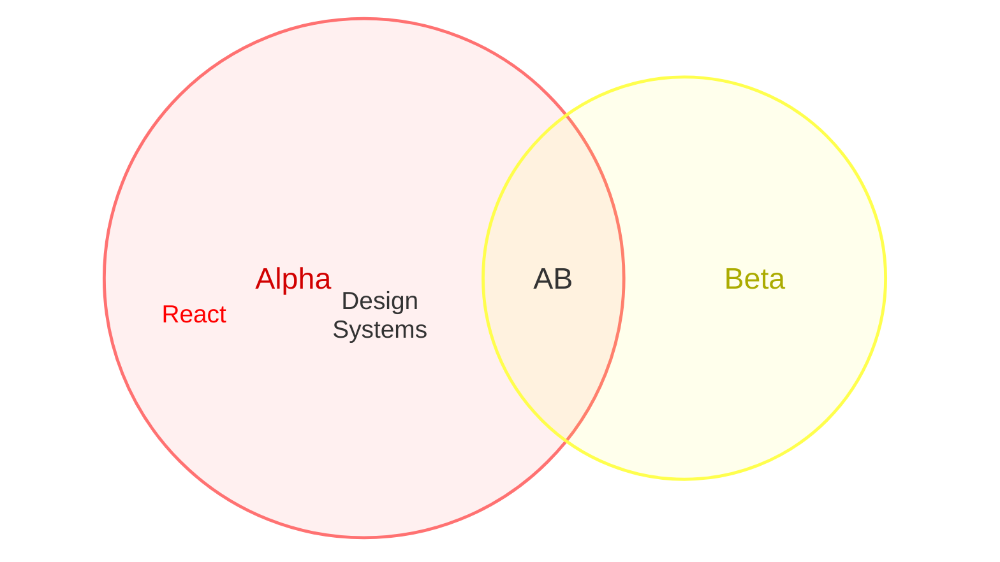
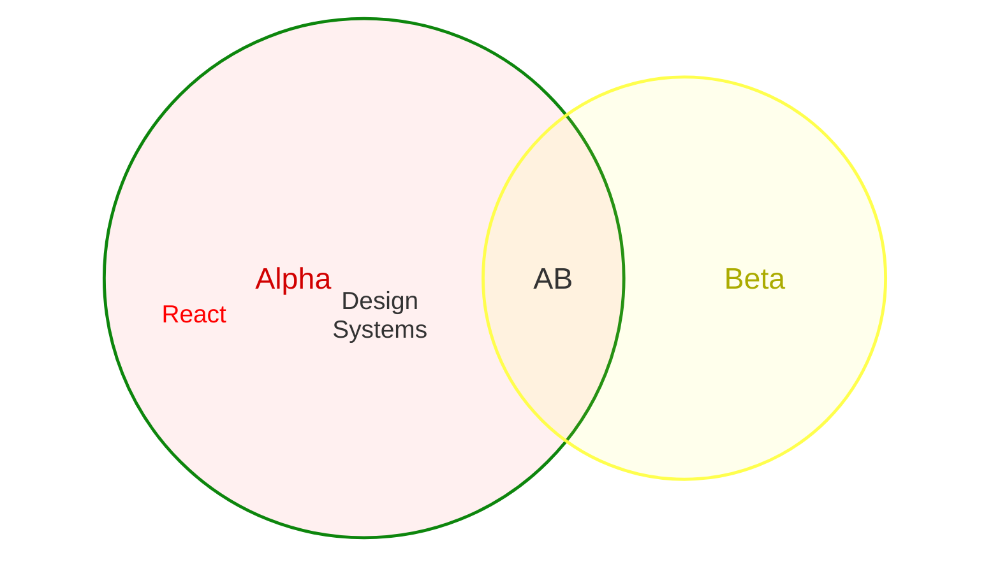
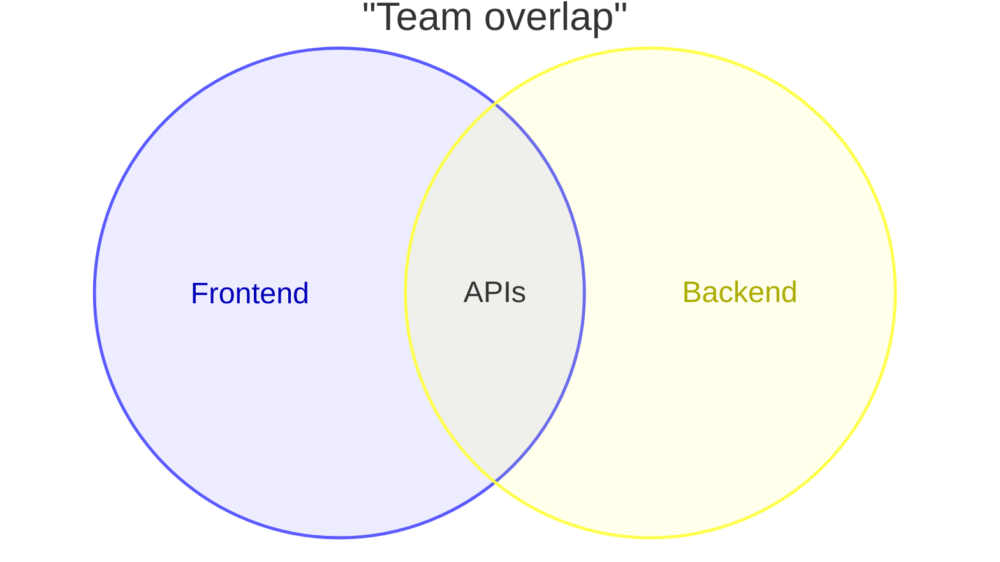
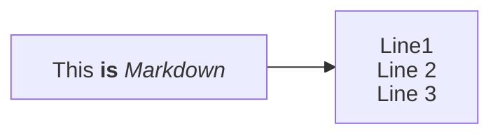
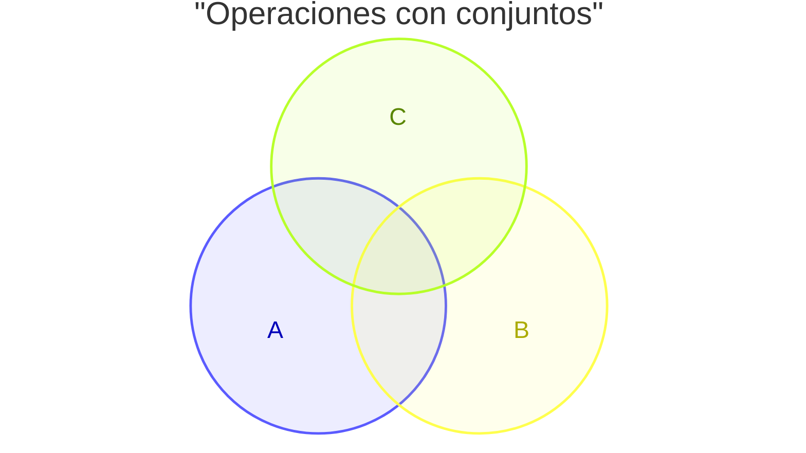

# Venn diagrams 
* https://mermaid.ai/open-source/syntax/venn.html

## Syntax

    Start with venn-beta.
    Use set for a single set name.
    Use union for an overlap of two or more set names.
    Identifiers in union must be defined by earlier set lines.
    Set identifiers can be bare words (A, Set_1) or quoted strings ("Foo Bar").



    



```mermaid
venn-beta
  set A["Alpha"]:20
    text A1["React"]
    text A2["Design Systems"]
  set B["Beta"]:5
  union A,B["AB"]:3
  style union A,B color:black
  style A fill:#ff6b6b
  style A,B color:#333
  style A stroke: green
  style A1 color:red
  style AB fill-opacity:white
```






